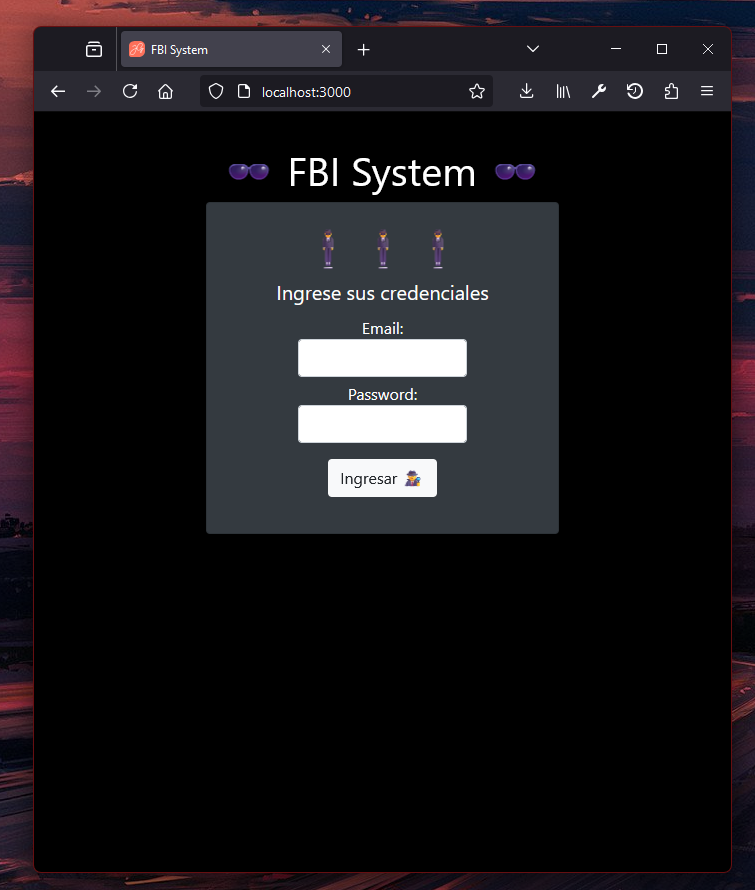

# Desafío FBI

El FBI está abriendo un departamento de informática y te ha contratado para crear el sistema
online que gestione misiones secretas, necesitarás programar un servidor con Express que
utilice JWT para la autorización de agentes que visiten las páginas restringidas.
En este desafío contarás con un Apoyo Desafío - FBI System en donde encontrarás un
documento JavaScript que exporta un arreglo de objetos correspondiente a las credenciales
de los agentes secretos, además de una interfaz hecha con HTML y Bootstrap. Siéntete libre
de crear tu propia maqueta si así lo deseas, siempre y cuando cumplas con los
requerimientos.

### Para inicializar el programa se requiere:

1. Instalar las dependencias usadas con el comando `npm i`.
2. Crear un archivo `.env` con las variables de entorno necesarias (JWT_SECRET_KEY).
3. Se requiere ejecutar el programa con el comando `npm run dev`.

Imagen de la aplicación:

## Josué Gallardo - g68 Bootcamp Talento Digital - Desafío Latam
